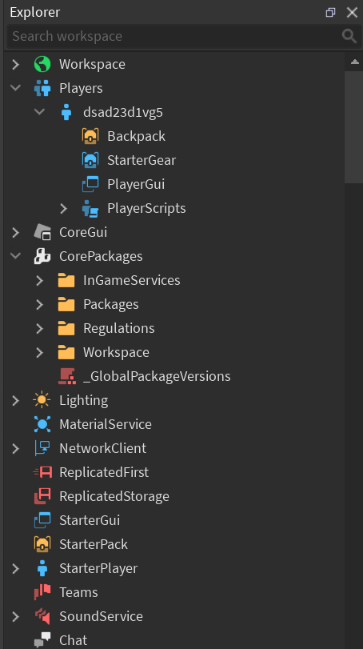
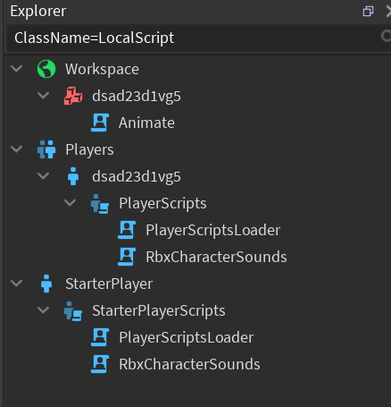

# Usage
```lua
loadstring(game:HttpGet("https://raw.githubusercontent.com/loglizzy/better-dex/refs/heads/main/dex.luau"))()
```

# Features
* Modern icons
* Explorer search by properties
  * `"ClassName=Part"` to see all the `Parts`
  * `"Name=Model,Parent=Folder"` to see `Models` inside some instance named `Folder`

# Screenshots
* 

* 
